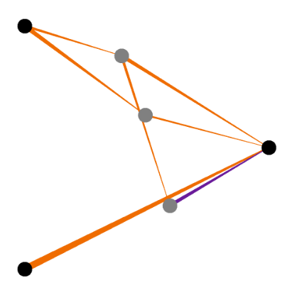
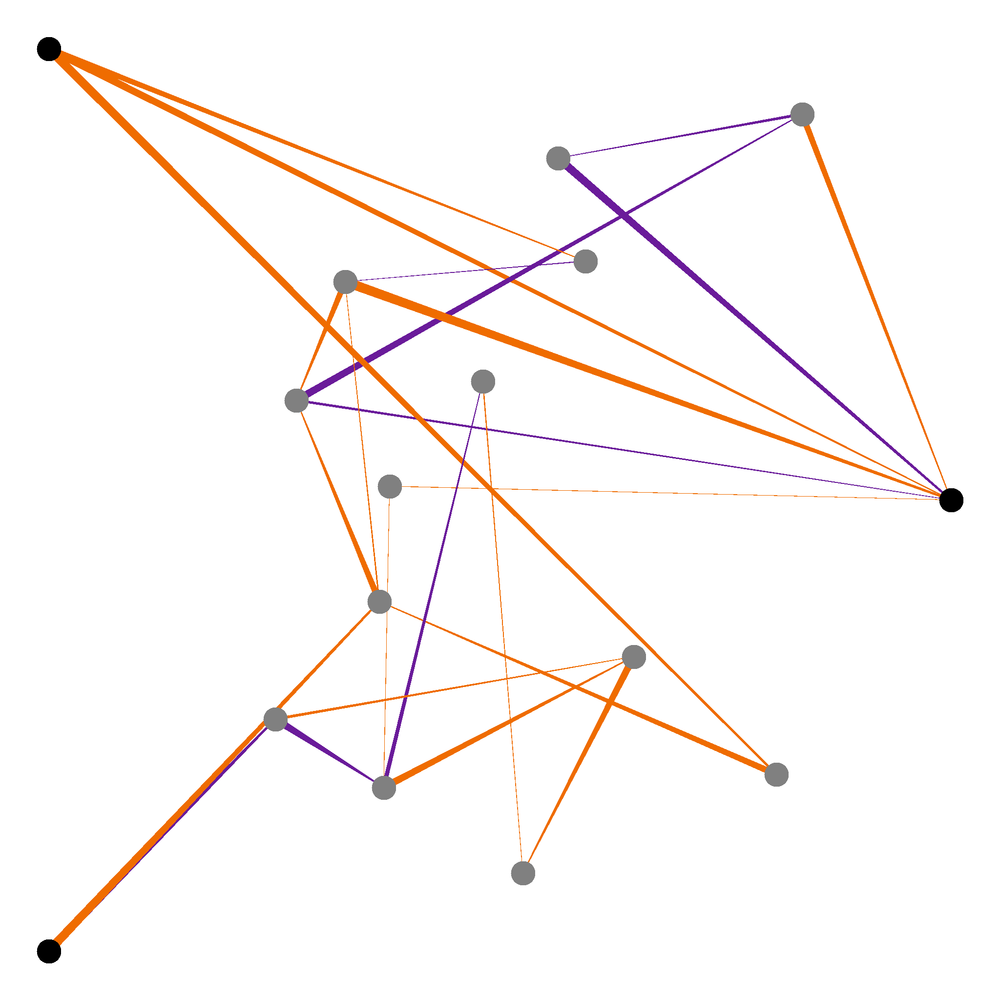

# neat-ml
An implementation of the NEAT (Neuroevolution through augmenting topologies) algorithm in Java. Originally found at http://nn.cs.utexas.edu/downloads/papers/stanley.ec02.pdf

## Features
* *Fully* documented code base ideal for learning and people new to the subject
    * Documentation can be found [here](https://jwblangley.github.io/neat-ml/)
* Super friendly highly abstracted interfaces that hide the implementation details, so you can focus on your use case
  * Friendly implementations of both genotypes and phenotypes
  * All you need to worry about is inputs, outputs and fitness!
* Multi-threading support for concurrent genotype evaluation just by specifying the number of worker threads
* Neural network visualiser to create images, so you can see what networks are created
* Full serializing and deserializing support using [google's protobuf](https://developers.google.com/protocol-buffers), allowing you to save interesting genotypes (networks) or even save your training progress to disk!

## Quick start
This library has been built with the intention of making it as easy as possible to add NEAT to any project - without the need for deep understanding of how NEAT works.

Take the following quick example that shows how to use this library to learn the XOR function:

**TLDR**
* a little bit of config
* create evolution (all the hard work has been done for you!)
    * Write the evaluator for a genotype
        * Convert the genotype into a neural network with the provided functions
        * Give the neural network inputs and receive its outputs in a single function
* Run the `evolve` function once for every generation
* Get the best performing genotype from the population
* Create a neural network from that genotype as before
* Done! You have a neural network that has learnt your desired behaviour

```java
import java.util.Random;
import jwblangley.neat.evolution.Evolution;
import jwblangley.neat.evolution.EvolutionFactory;
import jwblangley.neat.phenotype.Network;
import jwblangley.neat.genotype.NetworkGenotype;

public class LearnXor {
  public static void learnXor() {

    Random random = new Random();

    // Some configuration for the evolution
    final int numGenerations = 100;
    final int populationSize = 100;
    final int targetNumSpecies = 5;
    final int numProcessingThreads = 8;

    // Create a new optimisation with 2 inputs and 1 output
    Evolution evolution = EvolutionFactory.createOptimisation(2, 1, populationSize,
      targetNumSpecies, numProcessingThreads, networkGenotype -> {

          // Build a neural network from the genotype. This is all done for you with this method!
          // There is an equivalent method for building linear output networks
          Network network = Network.createSigmoidOutputNetworkFromGenotype(networkGenotype);

          // Now that a network has been created, evaluate it however you see fit!
          // To prevent over-fitting to a particular problem, we want to actually evaluate it
          // several times and aggregate a score (For XOR there are only 4 possible combinations,
          // but this is a good habit to get into for the general case).
          // N.B: If you are trying to solve a non-generalised problem, this is not needed
          // e.g. solving a particular game level that is deterministic (has no random elements)
          int numCorrect = 0;
          for (int i = 0; i < 5; i++) {
            final double a = Math.round(random.nextDouble());
            final double b = Math.round(random.nextDouble());

            // This is as simple as it is to get the output from your neural network!
            // We get the 0th index item as we want the first (and in this case only) output
            final double output = network.calculateOutputs(a, b).get(0);

            // Using "> 0.5" here is a good way to turn a sigmoid output (0-1) into a binary output!
            final boolean expected = (a > 0.5) ^ (b > 0.5);
            final boolean actual = output > 0.5;

            if (expected == actual) {
              numCorrect++;
            }
          }

          // Return a score that tells the program how well the network did! Higher is better!
          return numCorrect * 100d / testsInEvaluate;
        });

    // Evolve!
    evolution.setVerbose(true);
    for (int i = 1; i <= numGenerations; i++) {
      // This call is all you need to evolve your population (one generation)!
      evolution.evolve(random);

      System.out.println();
    }

    // After the evolution is done (you will need to experiment to know how much training you need)
    // Get the best genotype from the population
    NetworkGenotype bestInPop = evolution.getFittestGenotype();

    // Create the network from this genotype as we did before
    Network bestNetwork = Network.createSigmoidOutputNetworkFromGenotype(bestInPop);

    // Congratulations! You now have a neural network that knows XOR
    boolean ff = bestNetwork.calculateOutputs(0d, 0d).get(0) > 0.5;
    boolean ft = bestNetwork.calculateOutputs(0d, 1d).get(0) > 0.5;
    boolean tf = bestNetwork.calculateOutputs(1d, 0d).get(0) > 0.5;
    boolean tt = bestNetwork.calculateOutputs(1d, 1d).get(0) > 0.5;

    System.out.println("false XOR false = " + ff);
    System.out.println("false XOR true = " + ft);
    System.out.println("true XOR false = " + tf);
    System.out.println("true XOR true = " + tt);

    // Prints:
    // false XOR false = false
    // false XOR true = true
    // true XOR false = true
    // true XOR true = false

  }
}
```

### Visualiser

Visualising a neural network is a great way to understand a bit about what is going on and it also looks great!
The visualiser in this library has the following features:
* Different colours for positive and negative weights
  * Orange for positive
  * Purple for negative
* Different thicknesses based on connection weight
  * Thicker connections indicate greater (absolute) weights
* Tapers to show direction
  * Each connection is tapered from thicker to thinner to indicate connection direction

Visualising a network is as simple as:
```java
// network is genotype - for example from evolution.getFittestGenotype()
BufferedImage image  = Visualiser.visualiseNetwork(network);
```

You are then free to handle the standard java `BufferedImage` as you see fit. However, if you want to write the image to you disk you can utilise this library's function:
```java
Visualiser.saveImageToFile(image, new File("network.png"), true);
```

This can achieve results like this:



### Serialise
#### Networks
You can save a particular network genotype for later use. This could be so that you can keep track of the best/most interesting individuals and have them evaluate without the need for training. This is a great utility with many uses: for example embedding in games as the AI!

To write a network genotype to a file:
```java
ProtoIO.toFile(networkGenotype, new File("network.geno"));
```

To read a network genotype from a file:
```java
NetworkGenotype fromProto = ProtoIO.networkFromFile(new File("network.geno"))
```

Note that these networks are genotypes, not phenotypes. You will need to create them *in the same way as you did when training* before you can use them:
```java
// Or linear output!
Network network = Network.createSigmoidOutputNetworkFromGenotype(fromProto);

network.calculateOutputs(/* inputs here */);
```

#### Evolution
With this library comes the very powerful ability to stop training (evolving), save your progress and resume training again at a later date without losing progress.

```java
Evaluator evaluator = networkGenotype -> {
  /* evaluate here */
  return /* fitness */;
};

int populationSize = 100;
int targetNumSpecies = 5;
int numThreads = 8;

Evolution evolution = EvolutionFactory.createOptimisation(
  /* numInputs*/,
  /* numOutputs */,
  populationSize,
  targetNumSpecies,
  numThreads,
  evaluator);

for (int i = 0; i < 100; i++) {
  evolution.evolve();
}

/*
  .
  .
  .
  Get interrupted here
  .
  .
  .
*/

// Write to disk
ProtoIO.toFile(evolution, new File("evolution.evo"));

/*
  .
  .
  .
  Want to resume here
  .
  .
  .
*/

Evolution loadedEvolution = ProtoIO.evolutionFromFile(
  new File("evolution.evo");
  targetNumSpecies,
  numThreads,
  evaluator
);

// Continue evolution
for (int i = 0; i < 100; i++) {
  loadedEvolution.evolve();
}
```

This does actually give you the ability to define a new Evaluator (and the other params passed into `evolutionFromFile`) midway through training. This is normally not recommended, but can actually be very useful for some incremental learning techniques.
